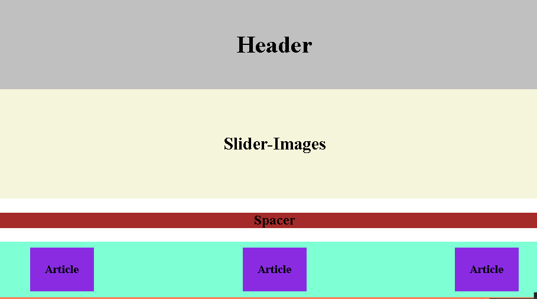

# hello-world

> My first repository using Git Hub

**Hi my name is Mar y Sol, I'm from Mexico and I'm starting to learn programing by my self using platforms like freeCodeCamp and programing courses in Coursera and other web pages.**

**For now I'm studing java script.**

## Built With

- CSS & HTML

## Live Demo

 [Live Demo Link](https://marilirulita.github.io/hello-world/)

## Getting Started

### Just click the live link and watch!

## Authors

👤 **Mar y Sol Bautista**

- GitHub: [@marilirulita](https://github.com/marilirulita)
- Linkedin: [Mar y Sol Bautista](https://www.linkedin.com/in/mar-y-sol-bautista-alvarez-5a6894151/)
- Twiter: [@marylirulita](https://twitter.com/marylirulita)

## 🤝 Contributing

Contributions, issues, and feature requests are welcome!

Feel free to check the [issues page](https://github.com/marilirulita/hello-world/issues).

## Show your support

Give a ⭐️ if you like this project!
